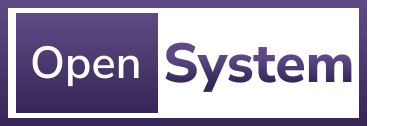

This repository contains modern and scalable web application code, additional utility applications/tools, and various libraries.

## Getting started

Once the code is pulled locally, open a command prompt and run `npm install` in the root repo directory (/open-system).

More information can be found in the [Open System documentation](https://sullivanpj.github.io/open-system/docs/getting-started/installation).

## Build

Run `nx build open-system` to build the project. The build artifacts will be stored in the `dist/` directory. Use the `--prod` flag for a production build.

## Development server

Run `nx serve open-system` for a dev server. Navigate to http://localhost:4200/. The app will automatically reload if you change any of the source files.

# Environment Configuration Help

If you run into any issues while trying to run any of the above steps, please reach out to Patrick.Sullivan.

## Plug-Ins

This repository uses the below plug-ins:

- [@nrwl/react](https://reactjs.org)
- [@nrwl/lint](https://nx.dev/linter/overview)
- [@nrwl/js](https://nx.dev/js/overview)
- [@nrwl/node](https://nodejs.org)
- [@nrwl/web](https://nx.dev/web/overview)
- [@nrwl/storybook](https://nx.dev/storybook/overview-react)

## Generate an application

Run `nx g @nrwl/react:app open-system` to generate an application.

> You can use any of the plugins above to generate applications as well.

When using Nx, you can create multiple applications and libraries in the same workspace.

## Generate a library

Run `nx g @nrwl/react:lib my-lib` to generate a library.

> You can also use any of the plugins above to generate libraries as well.

Libraries are shareable across libraries and applications. They can be imported from `@open-system/my-lib`.

## Code scaffolding

Run `nx g @nrwl/react:component my-component --project=open-system` to generate a new component.

## Running unit tests

Run `nx test open-system` to execute the unit tests via [Jest](https://jestjs.io).

Run `nx affected:test` to execute the unit tests affected by a change.

## Running end-to-end tests

Run `nx e2e open-system` to execute the end-to-end tests via [Cypress](https://www.cypress.io).

Run `nx affected:e2e` to execute the end-to-end tests affected by a change.

## Understand your workspace

Run `nx graph` to see a diagram of the dependencies of your projects.

## ☁ Nx Cloud

### Distributed Computation Caching & Distributed Task Execution

Nx Cloud pairs with Nx in order to enable you to build and test code more rapidly, by up to 10 times. Even teams that are new to Nx can connect to Nx Cloud and start saving time instantly.

Teams using Nx gain the advantage of building full-stack applications with their preferred framework alongside Nx’s advanced code generation and project dependency graph, plus a unified experience for both frontend and backend developers.

Visit [Nx Cloud](https://nx.app/) to learn more.

## Contributors ✨

Thanks goes to these wonderful people ([emoji key](https://allcontributors.org/docs/en/emoji-key)):

<!-- ALL-CONTRIBUTORS-LIST:START - Do not remove or modify this section -->
<!-- prettier-ignore-start -->
<!-- markdownlint-disable -->
<table>
  <tbody>
    <tr>
      <td align="center"><a href="http://www.sullypat.com/"> <b>Patrick Sullivan</b></a> <a href="#design-sullivanpj" title="Design">🎨</a> <a href="https://github.com/sullivanpj/open-system/commits?author=sullivanpj" title="Code">💻</a> <a href="#tool-sullivanpj" title="Tools">🔧</a> <a href="https://github.com/sullivanpj/open-system/commits?author=sullivanpj" title="Documentation">📖</a> <a href="https://github.com/sullivanpj/open-system/commits?author=sullivanpj" title="Tests">⚠️</a></td>
      <td align="center"><a href="https://tylerbenning.com/"> <b>Tyler Benning</b></a> <a href="#design-tbenning" title="Design">🎨</a></td>
    </tr>
  </tbody>
  <tfoot>
    <tr>
      <td align="center" size="13px" colspan="7">
        
          <a href="https://all-contributors.js.org/docs/en/bot/usage">Add your contributions</a>
        </img>
      </td>
    </tr>
  </tfoot>
</table>

<!-- markdownlint-restore -->
<!-- prettier-ignore-end -->

<!-- ALL-CONTRIBUTORS-LIST:END -->

This project follows the [all-contributors](https://github.com/all-contributors/all-contributors) specification. Contributions of any kind welcome!
