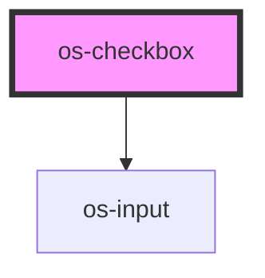

# os-checkbox

<!-- Auto Generated Below -->

## Properties

| Property   | Attribute   | Description                                                                   | Type      | Default     |
| ---------- | ----------- | ----------------------------------------------------------------------------- | --------- | ----------- |
| `disabled` | `disabled`  | Decides if input is disabled                                                  | `boolean` | `false`     |
| `info`     | `info`      | An info message displayed under the input                                     | `string`  | `undefined` |
| `label`    | `label`     | The text label displayed above the input field                                | `string`  | `undefined` |
| `name`     | `name`      | The name of the input field                                                   | `string`  | `undefined` |
| `noBorder` | `no-border` | Should the border displayed on the left side of the input field remain hidden | `boolean` | `false`     |
| `required` | `required`  | Decides if input field required                                               | `boolean` | `false`     |

## Dependencies

### Depends on

- [os-input](../os-input)

### Graph

----------------------------------------------

*Built with [StencilJS](https://stenciljs.com/)*
