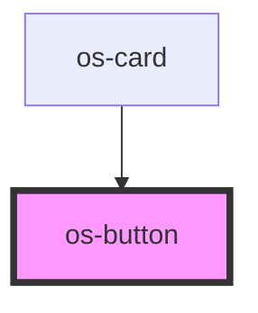

# os-button

<!-- Auto Generated Below -->

## Properties

| Property              | Attribute              | Description                                                                                | Type      | Default                           |
| --------------------- | ---------------------- | ------------------------------------------------------------------------------------------ | --------- | --------------------------------- |
| `disabled`            | `disabled`             | Is the button read-only (cannot be clicked by user)                                        | `boolean` | `false`                           |
| `glowType`            | `glow-type`            | Control how the bright glow around the button is emitted                                   | `string`  | `ButtonGlowTypes.HOVER`           |
| `hoverFill`           | `hover-fill`           | Is the button filled when hovered (the hover-text slot will not be used when set to false) | `boolean` | `true`                            |
| `inverse`             | `inverse`              | Is the button filled by default                                                            | `boolean` | `false`                           |
| `transitionDirection` | `transition-direction` | The direction the hover animation will start on                                            | `string`  | `ButtonTransitionDirections.LEFT` |
| `type`                | `type`                 | Is the button filled by default                                                            | `string`  | `ButtonTypes.BUTTON`              |
| `variant`             | `variant`              | The variant style of the button                                                            | `string`  | `ButtonVariants.PRIMARY`          |

## Events

| Event     | Description                                        | Type                      |
| --------- | -------------------------------------------------- | ------------------------- |
| `osClick` | Event emitted when the user clicks into the button | `CustomEvent<MouseEvent>` |

## Dependencies

### Used by

 - [os-card](../os-card)

### Graph

----------------------------------------------

*Built with [StencilJS](https://stenciljs.com/)*
