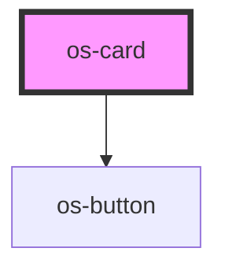

# os-card

<!-- Auto Generated Below -->

## Properties

| Property   | Attribute   | Description     | Type     | Default     |
| ---------- | ----------- | --------------- | -------- | ----------- |
| `header`   | `header`    | The first name  | `string` | `undefined` |
| `imageSrc` | `image-src` | The middle name | `string` | `undefined` |
| `summary`  | `summary`   | The last name   | `string` | `undefined` |

## Dependencies

### Depends on

- [os-button](../os-button)

### Graph

----------------------------------------------

*Built with [StencilJS](https://stenciljs.com/)*
